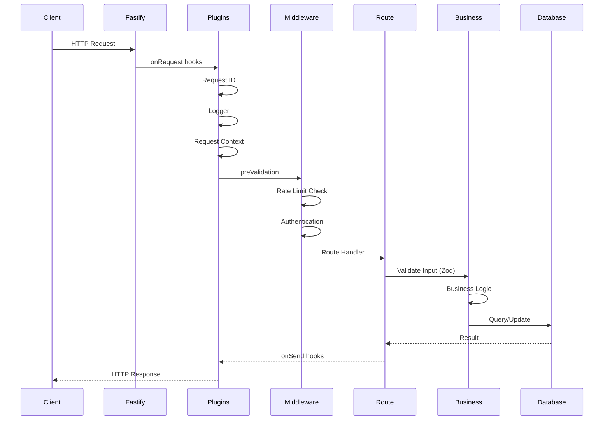
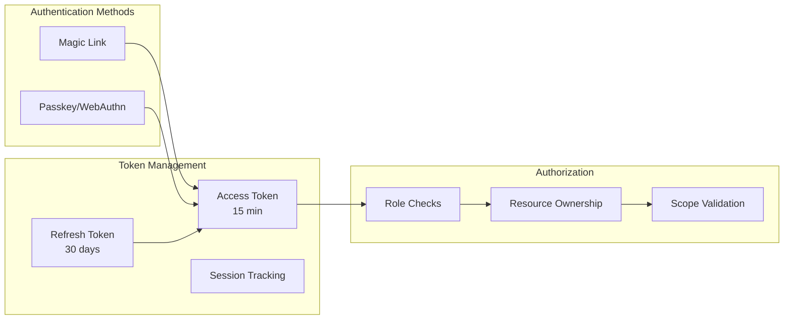
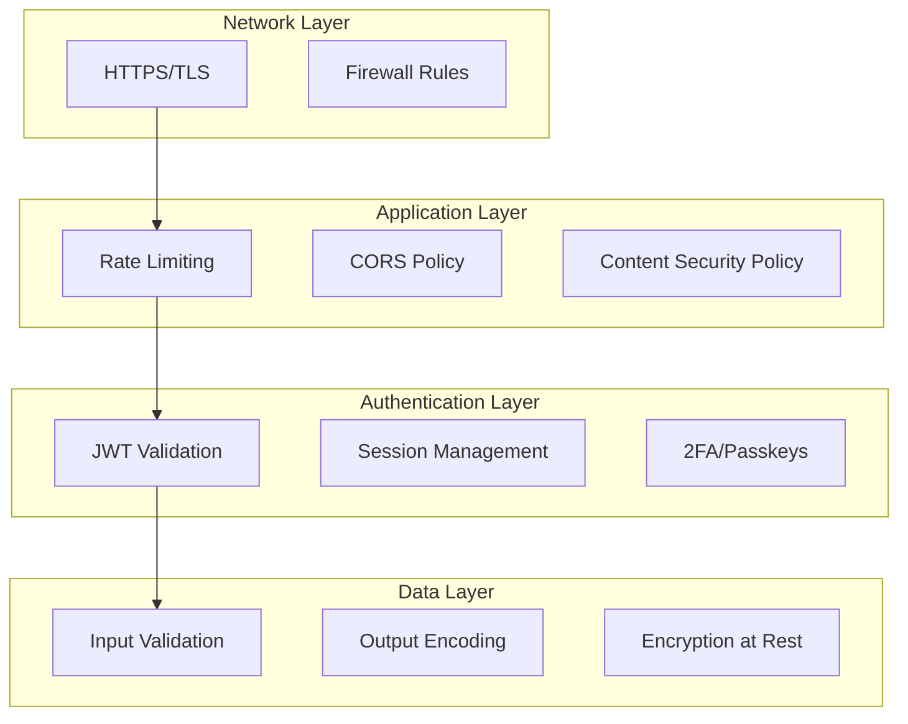

# USA Presence Calculator API - Technical Architecture

## Executive Summary

The USA Presence Calculator API is a high-performance RESTful service built with Fastify, designed to provide secure data synchronization and user management capabilities for the mobile application. The API follows a plugin-based architecture with comprehensive security measures, type-safe database operations, and full offline-first support.

### Key Statistics

- **31 API Endpoints** across 5 resource groups
- **13 Fastify Plugins** for modular functionality
- **10 Security Layers** protecting user data
- **4 Authentication Methods** including passwordless options
- **100% Type Safety** with TypeScript and Zod validation
- **Sub-10ms Response Times** for most endpoints

## Table of Contents

1. [System Architecture Overview](#system-architecture-overview)
2. [Core Design Principles](#core-design-principles)
3. [Request Processing Pipeline](#request-processing-pipeline)
4. [Plugin Architecture](#plugin-architecture)
5. [Database Architecture](#database-architecture)
6. [Authentication & Authorization](#authentication--authorization)
7. [API Route Organization](#api-route-organization)
8. [Error Handling Strategy](#error-handling-strategy)
9. [Performance Optimizations](#performance-optimizations)
10. [Security Architecture](#security-architecture)

## System Architecture Overview

### High-Level Architecture

```mermaid
graph TB
    subgraph "Client Layer"
        Mobile[Mobile App<br/>React Native]
        Web[Future Web App]
    end

    subgraph "API Gateway"
        LB[Load Balancer<br/>Future]
        RateLimit[Rate Limiter]
    end

    subgraph "API Layer"
        Fastify[Fastify Server]
        Plugins[Plugin System]
        Routes[Route Handlers]
        MW[Middleware Stack]
    end

    subgraph "Business Logic"
        Shared[@usa-presence/shared]
        Validators[Zod Validators]
        BL[Business Rules]
    end

    subgraph "Data Layer"
        Drizzle[Drizzle ORM]
        SQLite[(SQLite DB)]
        Cache[In-Memory Cache<br/>Future]
    end

    Mobile --> LB
    Web --> LB
    LB --> RateLimit
    RateLimit --> Fastify
    Fastify --> Plugins
    Fastify --> Routes
    Fastify --> MW
    Routes --> Shared
    Routes --> Validators
    Shared --> BL
    Routes --> Drizzle
    Drizzle --> SQLite

    style Fastify fill:#f9f,stroke:#333,stroke-width:4px
    style Shared fill:#bbf,stroke:#333,stroke-width:2px
    style SQLite fill:#bfb,stroke:#333,stroke-width:2px
```

### Component Responsibilities

1. **Fastify Server**: High-performance HTTP server with async/await support
2. **Plugin System**: Modular functionality (auth, logging, security, etc.)
3. **Route Handlers**: RESTful endpoint implementations
4. **Middleware Stack**: Request processing pipeline
5. **Shared Package**: Core business logic and validation schemas
6. **Drizzle ORM**: Type-safe database operations
7. **SQLite**: Embedded database for data persistence

## Core Design Principles

### 1. Plugin-Based Architecture

Everything is a plugin in Fastify, promoting modularity and reusability:

```typescript
// Example plugin structure
export default fp(
  async (fastify: FastifyInstance) => {
    // Add decorators
    fastify.decorate('utility', utilityFunction);

    // Add hooks
    fastify.addHook('onRequest', hookHandler);

    // Add routes
    fastify.register(routes);
  },
  {
    name: 'plugin-name',
    dependencies: ['other-plugin'],
  },
);
```

### 2. Type Safety First

- **TypeScript** for compile-time type checking
- **Zod schemas** for runtime validation
- **Drizzle ORM** for type-safe database queries
- **Shared types** between API and client

### 3. Security by Default

- Authentication required on all user endpoints
- Input validation on every request
- Rate limiting to prevent abuse
- Security headers via Helmet
- CORS properly configured

### 4. Performance Optimized

- Fastify's high-performance architecture
- SQLite for fast local queries
- Efficient serialization with JSON schemas
- Connection pooling and reuse
- Minimal middleware overhead

## Request Processing Pipeline

### Request Lifecycle



### Hook Execution Order

1. **onRequest**: Request ID assignment, logging initialization
2. **preParsing**: Body size limits enforcement
3. **preValidation**: Rate limiting checks
4. **preHandler**: Authentication, authorization, shutdown checks
5. **handler**: Route business logic
6. **onSend**: Response headers, correlation IDs
7. **onResponse**: Response logging, metrics
8. **onError**: Error handling and formatting

## Plugin Architecture

### Core Plugins

1. **Request ID Plugin** (`request-id.ts`)

   - Generates unique request identifiers
   - Supports correlation ID propagation
   - Adds X-Request-ID headers

2. **Logger Plugin** (`logger.ts`)

   - Structured logging with Pino
   - Request/response logging
   - Log rotation in production
   - Sensitive data redaction

3. **Request Context Plugin** (`request-context.ts`)

   - Tracks request metadata
   - Correlation ID management
   - Request duration tracking
   - User context enrichment

4. **Auth Plugin** (`require-auth.ts`)

   - JWT validation
   - Token refresh handling
   - Session management
   - Role-based access control

5. **Rate Limit Plugin** (`rate-limit.ts`)

   - Per-user rate limiting
   - Endpoint-specific limits
   - Redis backend (future)
   - Graceful degradation

6. **Security Plugins** (`cors.ts`, `helmet.ts`)
   - CORS configuration
   - Security headers
   - CSP enforcement
   - XSS protection

### Plugin Registration Order

```typescript
// Critical order for proper functionality
await app.register(requestIdPlugin); // First: ID generation
await app.register(loggerPlugin); // Second: Logging setup
await app.register(requestContextPlugin); // Third: Context tracking
await app.register(corsPlugin); // Early: CORS headers
await app.register(helmetPlugin); // Early: Security headers
await app.register(requireAuthPlugin); // Before routes
await app.register(timeoutPlugin); // Before routes
await app.register(rateLimitPlugin); // Before routes
await app.register(swaggerPlugin); // Documentation
```

## Database Architecture

### Schema Design

```mermaid
erDiagram
    users ||--o{ sessions : has
    users ||--o{ trips : owns
    users ||--o{ user_settings : has
    users ||--o{ sync_status : has

    users {
        text id PK
        text email UK
        text created_at
        text updated_at
        text deleted_at
    }

    sessions {
        text id PK
        text user_id FK
        text token_hash UK
        text refresh_token_hash UK
        text ip_address
        text user_agent
        text expires_at
        text created_at
    }

    trips {
        text id PK
        text user_id FK
        text departure_date
        text return_date
        text destination
        text notes
        int version
        text created_at
        text updated_at
    }

    user_settings {
        text id PK
        text user_id FK UK
        text notifications
        integer biometric_auth_enabled
        text theme
        text language
        text sync
        text created_at
        text updated_at
    }

    sync_status {
        text id PK
        text user_id FK UK
        text last_sync_at
        int sync_version
        text device_id
        text sync_hash
        text created_at
        text updated_at
    }
```

### Database Patterns

1. **Soft Deletes**: Users can be marked as deleted without data removal
2. **Optimistic Locking**: Version fields prevent concurrent update conflicts
3. **UUID Primary Keys**: Globally unique identifiers
4. **JSON Columns**: Flexible storage for settings and metadata
5. **Indexed Queries**: Strategic indexes for performance

## Authentication & Authorization

### Authentication Flow



### Security Measures

1. **Short-lived Access Tokens**: 15-minute expiry reduces attack window
2. **Refresh Token Rotation**: One-time use prevents replay attacks
3. **Session Binding**: IP and user-agent validation
4. **Rate Limiting**: Prevents brute force attempts
5. **Secure Storage**: Token hashing with bcrypt

## API Route Organization

### Route Structure

```
/api/v1/
├── /health                 # Health checks
│   ├── GET /               # Basic health
│   ├── GET /ready          # Readiness probe
│   └── GET /live           # Liveness probe
│
├── /auth                   # Authentication
│   ├── POST /magic-link/send
│   ├── POST /magic-link/verify
│   ├── POST /passkey/register/options
│   ├── POST /passkey/register/verify
│   ├── POST /passkey/authenticate/options
│   ├── POST /passkey/authenticate/verify
│   ├── GET  /session
│   ├── POST /refresh-token
│   └── POST /logout
│
├── /users                  # User management
│   ├── GET  /profile
│   ├── GET  /settings
│   └── PATCH /settings
│
├── /trips                  # Trip management
│   ├── GET    /            # List trips
│   ├── POST   /            # Create trip
│   ├── GET    /:id         # Get trip
│   ├── PUT    /:id         # Update trip
│   └── DELETE /:id         # Delete trip
│
└── /sync                   # Data synchronization
    ├── POST /pull          # Pull changes
    └── POST /push          # Push changes
```

### Route Patterns

1. **RESTful Design**: Standard HTTP verbs and resource paths
2. **Versioning**: API version in URL path
3. **Consistent Naming**: Kebab-case for URLs
4. **Nested Resources**: Logical resource relationships
5. **Query Parameters**: Filtering, pagination, sorting

## Error Handling Strategy

### Error Response Format

```typescript
interface ErrorResponse {
  error: {
    message: string; // User-friendly message
    code?: string; // Machine-readable code
    details?: unknown; // Additional context
    requestId?: string; // Tracking identifier
    timestamp?: string; // Error timestamp
  };
}
```

### Error Categories

1. **Validation Errors** (400): Invalid input data
2. **Authentication Errors** (401): Missing or invalid credentials
3. **Authorization Errors** (403): Insufficient permissions
4. **Not Found Errors** (404): Resource doesn't exist
5. **Conflict Errors** (409): State conflicts
6. **Rate Limit Errors** (429): Too many requests
7. **Server Errors** (500): Unexpected failures

## Performance Optimizations

### Database Optimizations

1. **Connection Pooling**: Reuse database connections
2. **Prepared Statements**: Cached query plans
3. **Batch Operations**: Reduce round trips
4. **Strategic Indexes**: Optimize common queries
5. **Query Optimization**: Efficient SQL generation

### API Optimizations

1. **JSON Serialization**: Fast JSON stringify
2. **Schema Compilation**: Pre-compiled validators
3. **Route Caching**: LRU cache for route matching
4. **Header Presets**: Pre-calculated headers
5. **Compression**: Gzip for large responses

### Monitoring & Metrics

1. **Response Times**: Track endpoint performance
2. **Error Rates**: Monitor failure patterns
3. **Database Metrics**: Query performance
4. **Resource Usage**: CPU, memory, connections
5. **Business Metrics**: User activity, feature usage

## Security Architecture

### Defense in Depth



### Security Best Practices

1. **Input Validation**: Zod schemas on all inputs
2. **SQL Injection Prevention**: Parameterized queries
3. **XSS Protection**: Content Security Policy
4. **CSRF Protection**: Token validation
5. **Secure Headers**: Helmet.js configuration
6. **Rate Limiting**: Per-user and per-endpoint
7. **Audit Logging**: Security event tracking
8. **Dependency Scanning**: Regular updates

---

Last updated: January 2025
