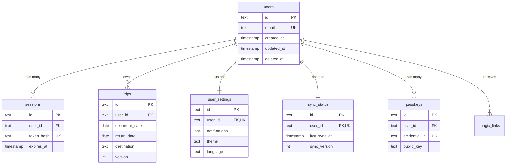

# Database Reference - USA Presence Calculator API

This document provides comprehensive documentation for the database schema, relationships, queries, and best practices used in the API.

## Table of Contents

1. [Database Overview](#database-overview)
2. [Schema Definitions](#schema-definitions)
3. [Table Relationships](#table-relationships)
4. [Indexes and Performance](#indexes-and-performance)
5. [Common Queries](#common-queries)
6. [Database Patterns](#database-patterns)
7. [Migration Strategy](#migration-strategy)
8. [Best Practices](#best-practices)

## Database Overview

### Technology Stack

- **Database**: SQLite 3
- **Driver**: better-sqlite3 (synchronous, high-performance)
- **ORM**: Drizzle ORM (type-safe SQL)
- **Migration Tool**: Drizzle Kit

### Why SQLite?

1. **Embedded**: No separate database server required
2. **Performance**: Excellent for read-heavy workloads
3. **Reliability**: ACID compliant with WAL mode
4. **Portability**: Single file database
5. **Simplicity**: Zero configuration

### Database Configuration

```typescript
// Database initialization
const db = new Database(DB_CONFIG.FILENAME, {
  verbose: DB_CONFIG.VERBOSE ? console.log : undefined,
});

// Enable WAL mode for better concurrency
db.pragma('journal_mode = WAL');

// Enable foreign key constraints
db.pragma('foreign_keys = ON');

// Set busy timeout to prevent locks
db.pragma('busy_timeout = 5000');

// Optimize for performance
db.pragma('synchronous = NORMAL');
db.pragma('cache_size = -64000'); // 64MB
db.pragma('temp_store = MEMORY');
```

## Schema Definitions

### Users Table

```typescript
export const users = sqliteTable('users', {
  id: text('id', { length: 21 }).primaryKey(), // CUID2
  email: text('email', { length: 255 }).notNull().unique(),
  createdAt: text('created_at')
    .notNull()
    .default(sql`CURRENT_TIMESTAMP`),
  updatedAt: text('updated_at')
    .notNull()
    .default(sql`CURRENT_TIMESTAMP`),
  deletedAt: text('deleted_at'), // Soft delete
});

// TypeScript type
export type User = InferSelectModel<typeof users>;
export type NewUser = InferInsertModel<typeof users>;
```

**Purpose**: Store user account information

**Fields**:

- `id`: CUID2 unique identifier
- `email`: User's email address (unique)
- `createdAt`: Account creation timestamp
- `updatedAt`: Last modification timestamp
- `deletedAt`: Soft deletion timestamp

### Sessions Table

```typescript
export const sessions = sqliteTable(
  'sessions',
  {
    id: text('id', { length: 21 }).primaryKey(),
    userId: text('user_id', { length: 21 })
      .notNull()
      .references(() => users.id, { onDelete: 'cascade' }),
    tokenHash: text('token_hash', { length: 64 }).notNull().unique(),
    refreshTokenHash: text('refresh_token_hash', { length: 64 }).unique(),
    ipAddress: text('ip_address', { length: 45 }), // IPv6 compatible
    userAgent: text('user_agent', { length: 500 }),
    expiresAt: text('expires_at').notNull(),
    createdAt: text('created_at')
      .notNull()
      .default(sql`CURRENT_TIMESTAMP`),
  },
  (table) => ({
    userIdIdx: index('sessions_user_id_idx').on(table.userId),
    expiresAtIdx: index('sessions_expires_at_idx').on(table.expiresAt),
  }),
);

export type Session = InferSelectModel<typeof sessions>;
```

**Purpose**: Manage user authentication sessions

**Fields**:

- `id`: Session identifier
- `userId`: Reference to user
- `tokenHash`: Hashed access token
- `refreshTokenHash`: Hashed refresh token
- `ipAddress`: Client IP for security
- `userAgent`: Client user agent
- `expiresAt`: Session expiration
- `createdAt`: Session creation time

**Indexes**:

- `userId`: Fast user session lookup
- `expiresAt`: Efficient expired session cleanup

### Trips Table

```typescript
export const trips = sqliteTable(
  'trips',
  {
    id: text('id', { length: 21 }).primaryKey(),
    userId: text('user_id', { length: 21 })
      .notNull()
      .references(() => users.id, { onDelete: 'cascade' }),
    departureDate: text('departure_date').notNull(),
    returnDate: text('return_date').notNull(),
    destination: text('destination', { length: 100 }).notNull(),
    purpose: text('purpose', { length: 50 }),
    notes: text('notes', { length: 500 }),
    version: integer('version').notNull().default(1), // Optimistic locking
    createdAt: text('created_at')
      .notNull()
      .default(sql`CURRENT_TIMESTAMP`),
    updatedAt: text('updated_at')
      .notNull()
      .default(sql`CURRENT_TIMESTAMP`),
    deletedAt: text('deleted_at'), // Soft delete for sync
  },
  (table) => ({
    userIdIdx: index('trips_user_id_idx').on(table.userId),
    departureDateIdx: index('trips_departure_date_idx').on(table.departureDate),
    userDepartureIdx: index('trips_user_departure_idx').on(table.userId, table.departureDate),
  }),
);

export type Trip = InferSelectModel<typeof trips>;
```

**Purpose**: Store user travel history

**Fields**:

- `id`: Trip identifier
- `userId`: Trip owner
- `departureDate`: Date leaving USA (YYYY-MM-DD)
- `returnDate`: Date returning to USA (YYYY-MM-DD)
- `destination`: Country/place visited
- `purpose`: Travel purpose (optional)
- `notes`: Additional notes (optional)
- `version`: Optimistic locking counter
- `createdAt`: Record creation
- `updatedAt`: Last modification
- `deletedAt`: Soft deletion for sync

**Indexes**:

- `userId`: User's trips lookup
- `departureDate`: Date-based queries
- `userDepartureIdx`: Composite for user + date queries

### User Settings Table

```typescript
export const userSettings = sqliteTable('user_settings', {
  id: text('id', { length: 21 }).primaryKey(),
  userId: text('user_id', { length: 21 })
    .notNull()
    .unique()
    .references(() => users.id, { onDelete: 'cascade' }),
  notifications: text('notifications', { mode: 'json' })
    .$type<NotificationSettings>()
    .notNull()
    .default(sql`'{"milestones":true,"warnings":true,"reminders":true}'`),
  biometricAuthEnabled: integer('biometric_auth_enabled', { mode: 'boolean' })
    .notNull()
    .default(false),
  theme: text('theme', { enum: ['system', 'light', 'dark'] })
    .notNull()
    .default('system'),
  language: text('language', { enum: ['en', 'es'] })
    .notNull()
    .default('en'),
  sync: text('sync', { mode: 'json' })
    .$type<SyncSettings>()
    .notNull()
    .default(sql`'{"enabled":false,"subscriptionTier":"none"}'`),
  createdAt: text('created_at')
    .notNull()
    .default(sql`CURRENT_TIMESTAMP`),
  updatedAt: text('updated_at')
    .notNull()
    .default(sql`CURRENT_TIMESTAMP`),
});

// Type definitions
interface NotificationSettings {
  milestones: boolean;
  warnings: boolean;
  reminders: boolean;
}

interface SyncSettings {
  enabled: boolean;
  subscriptionTier: 'none' | 'basic' | 'premium';
  lastSyncAt?: string;
  deviceId?: string;
}
```

**Purpose**: Store user preferences and settings

**Fields**:

- `id`: Settings record ID
- `userId`: User reference (unique)
- `notifications`: JSON notification preferences
- `biometricAuthEnabled`: Biometric auth flag
- `theme`: UI theme preference
- `language`: Language preference
- `sync`: JSON sync configuration
- `createdAt`: Record creation
- `updatedAt`: Last modification

### Sync Status Table

```typescript
export const syncStatus = sqliteTable('sync_status', {
  id: text('id', { length: 21 }).primaryKey(),
  userId: text('user_id', { length: 21 })
    .notNull()
    .unique()
    .references(() => users.id, { onDelete: 'cascade' }),
  lastSyncAt: text('last_sync_at'),
  syncVersion: integer('sync_version').notNull().default(0),
  deviceId: text('device_id', { length: 50 }),
  syncHash: text('sync_hash', { length: 64 }), // Data integrity check
  pendingChanges: integer('pending_changes').notNull().default(0),
  lastModifiedAt: text('last_modified_at'),
  createdAt: text('created_at')
    .notNull()
    .default(sql`CURRENT_TIMESTAMP`),
  updatedAt: text('updated_at')
    .notNull()
    .default(sql`CURRENT_TIMESTAMP`),
});
```

**Purpose**: Track synchronization state per user

**Fields**:

- `id`: Sync status ID
- `userId`: User reference (unique)
- `lastSyncAt`: Last successful sync
- `syncVersion`: Incremental sync version
- `deviceId`: Primary device identifier
- `syncHash`: Data integrity hash
- `pendingChanges`: Count of unsynced changes
- `lastModifiedAt`: Last data modification
- `createdAt`: Record creation
- `updatedAt`: Status update time

### Magic Links Table

```typescript
export const magicLinks = sqliteTable(
  'magic_links',
  {
    id: text('id', { length: 21 }).primaryKey(),
    email: text('email', { length: 255 }).notNull(),
    tokenHash: text('token_hash', { length: 64 }).notNull().unique(),
    expiresAt: text('expires_at').notNull(),
    usedAt: text('used_at'),
    ipAddress: text('ip_address', { length: 45 }),
    userAgent: text('user_agent', { length: 500 }),
    createdAt: text('created_at')
      .notNull()
      .default(sql`CURRENT_TIMESTAMP`),
  },
  (table) => ({
    emailIdx: index('magic_links_email_idx').on(table.email),
    expiresAtIdx: index('magic_links_expires_at_idx').on(table.expiresAt),
  }),
);
```

**Purpose**: Temporary passwordless authentication tokens

**Fields**:

- `id`: Link identifier
- `email`: Target email address
- `tokenHash`: Hashed token
- `expiresAt`: Link expiration
- `usedAt`: Usage timestamp
- `ipAddress`: Request IP
- `userAgent`: Request user agent
- `createdAt`: Link creation

**Indexes**:

- `email`: Email-based lookups
- `expiresAt`: Cleanup queries

### Passkeys Table

```typescript
export const passkeys = sqliteTable(
  'passkeys',
  {
    id: text('id', { length: 21 }).primaryKey(),
    userId: text('user_id', { length: 21 })
      .notNull()
      .references(() => users.id, { onDelete: 'cascade' }),
    credentialId: text('credential_id', { length: 255 }).notNull().unique(),
    publicKey: text('public_key').notNull(),
    counter: integer('counter').notNull().default(0),
    deviceName: text('device_name', { length: 100 }),
    lastUsedAt: text('last_used_at'),
    createdAt: text('created_at')
      .notNull()
      .default(sql`CURRENT_TIMESTAMP`),
  },
  (table) => ({
    userIdIdx: index('passkeys_user_id_idx').on(table.userId),
  }),
);
```

**Purpose**: WebAuthn passkey credentials

**Fields**:

- `id`: Passkey identifier
- `userId`: Owner reference
- `credentialId`: WebAuthn credential ID
- `publicKey`: Public key data
- `counter`: Signature counter
- `deviceName`: Friendly device name
- `lastUsedAt`: Last authentication
- `createdAt`: Registration time

## Table Relationships



## Indexes and Performance

### Primary Indexes

All tables use CUID2 as primary keys with automatic B-tree indexes.

### Secondary Indexes

```sql
-- User lookups
CREATE UNIQUE INDEX users_email_idx ON users(email);

-- Session management
CREATE INDEX sessions_user_id_idx ON sessions(user_id);
CREATE INDEX sessions_expires_at_idx ON sessions(expires_at);

-- Trip queries
CREATE INDEX trips_user_id_idx ON trips(user_id);
CREATE INDEX trips_departure_date_idx ON trips(departure_date);
CREATE INDEX trips_user_departure_idx ON trips(user_id, departure_date);

-- Magic link cleanup
CREATE INDEX magic_links_email_idx ON magic_links(email);
CREATE INDEX magic_links_expires_at_idx ON magic_links(expires_at);

-- Passkey lookups
CREATE INDEX passkeys_user_id_idx ON passkeys(user_id);
```

### Query Performance

1. **User trips by date range**:

   ```sql
   SELECT * FROM trips
   WHERE user_id = ?
   AND departure_date BETWEEN ? AND ?
   ORDER BY departure_date DESC;
   -- Uses: trips_user_departure_idx
   ```

2. **Active sessions**:

   ```sql
   SELECT * FROM sessions
   WHERE user_id = ?
   AND expires_at > datetime('now');
   -- Uses: sessions_user_id_idx
   ```

3. **Expired token cleanup**:
   ```sql
   DELETE FROM sessions WHERE expires_at < datetime('now');
   DELETE FROM magic_links WHERE expires_at < datetime('now');
   -- Uses: expires_at indexes
   ```

## Common Queries

### User Authentication

```typescript
// Find user by email
const user = db.select().from(users).where(eq(users.email, email)).get();

// Create session
const session = db
  .insert(sessions)
  .values({
    id: createId(),
    userId: user.id,
    tokenHash: hash(token),
    refreshTokenHash: hash(refreshToken),
    ipAddress: request.ip,
    userAgent: request.headers['user-agent'],
    expiresAt: addMinutes(new Date(), 15).toISOString(),
  })
  .returning()
  .get();

// Verify session
const session = db
  .select()
  .from(sessions)
  .where(and(eq(sessions.tokenHash, hash(token)), gt(sessions.expiresAt, new Date().toISOString())))
  .get();
```

### Trip Management

```typescript
// List user trips with pagination
const trips = db
  .select()
  .from(trips)
  .where(and(eq(trips.userId, userId), isNull(trips.deletedAt)))
  .orderBy(desc(trips.departureDate))
  .limit(limit)
  .offset(offset)
  .all();

// Create trip
const trip = db
  .insert(trips)
  .values({
    id: createId(),
    userId,
    departureDate,
    returnDate,
    destination,
    purpose,
    notes,
  })
  .returning()
  .get();

// Update with optimistic locking
const updated = db
  .update(trips)
  .set({
    ...updates,
    version: sql`${trips.version} + 1`,
    updatedAt: new Date().toISOString(),
  })
  .where(and(eq(trips.id, tripId), eq(trips.userId, userId), eq(trips.version, currentVersion)))
  .returning()
  .get();
```

### Sync Operations

```typescript
// Get changes since last sync
const changes = db
  .select()
  .from(trips)
  .where(and(eq(trips.userId, userId), gt(trips.updatedAt, lastSyncAt)))
  .all();

// Update sync status
db.update(syncStatus)
  .set({
    lastSyncAt: new Date().toISOString(),
    syncVersion: sql`${syncStatus.syncVersion} + 1`,
    syncHash: generateHash(data),
    pendingChanges: 0,
  })
  .where(eq(syncStatus.userId, userId))
  .run();
```

## Database Patterns

### Soft Deletes

```typescript
// Soft delete implementation
function softDelete(table: Table, id: string, userId: string) {
  return db
    .update(table)
    .set({
      deletedAt: new Date().toISOString(),
      updatedAt: new Date().toISOString(),
    })
    .where(and(eq(table.id, id), eq(table.userId, userId), isNull(table.deletedAt)))
    .run();
}

// Query excluding soft deletes
const activeRecords = db.select().from(table).where(isNull(table.deletedAt)).all();
```

### Optimistic Locking

```typescript
// Update with version check
async function updateWithLock<T>(
  table: Table,
  id: string,
  updates: Partial<T>,
  currentVersion: number,
): Promise<T | null> {
  const [updated] = await db
    .update(table)
    .set({
      ...updates,
      version: sql`${table.version} + 1`,
      updatedAt: new Date().toISOString(),
    })
    .where(and(eq(table.id, id), eq(table.version, currentVersion)))
    .returning();

  return updated || null;
}
```

### Transactions

```typescript
// Multi-table transaction
function createTripWithSync(userId: string, tripData: NewTrip) {
  return db.transaction((tx) => {
    // Create trip
    const trip = tx.insert(trips).values(tripData).returning().get();

    // Update sync status
    tx.update(syncStatus)
      .set({
        pendingChanges: sql`${syncStatus.pendingChanges} + 1`,
        lastModifiedAt: new Date().toISOString(),
      })
      .where(eq(syncStatus.userId, userId))
      .run();

    return trip;
  });
}
```

## Migration Strategy

### Migration Files

```
migrations/
├── 0001_initial_schema.sql
├── 0002_add_sync_tables.sql
├── 0003_add_indexes.sql
└── meta/
    └── _journal.json
```

### Running Migrations

```typescript
// Development
pnpm db:generate  // Generate migration from schema changes
pnpm db:migrate   // Apply migrations
pnpm db:studio    // Visual database browser

// Production
// Migrations run automatically on startup
await migrate(db, { migrationsFolder: './migrations' });
```

### Migration Best Practices

1. **Always test migrations** on a copy of production data
2. **Keep migrations small** and focused
3. **Never modify** existing migration files
4. **Use transactions** for multi-step migrations
5. **Add indexes** in separate migrations
6. **Document** breaking changes

### Example Migration

```sql
-- 0004_add_trip_indexes.sql
BEGIN TRANSACTION;

-- Add composite index for common query
CREATE INDEX IF NOT EXISTS trips_user_date_dest_idx
ON trips(user_id, departure_date, destination);

-- Add index for destination search
CREATE INDEX IF NOT EXISTS trips_destination_idx
ON trips(destination);

-- Update migration version
INSERT INTO migrations (version, applied_at)
VALUES (4, datetime('now'));

COMMIT;
```

## Best Practices

### Query Optimization

1. **Use indexes** for frequently queried columns
2. **Avoid SELECT \*** - specify needed columns
3. **Use EXPLAIN QUERY PLAN** to analyze queries
4. **Batch operations** when possible
5. **Limit result sets** with pagination

### Data Integrity

1. **Use foreign keys** with appropriate cascades
2. **Validate data** at application level (Zod)
3. **Use transactions** for related operations
4. **Implement soft deletes** for sync support
5. **Add unique constraints** where needed

### Security

1. **Parameterize all queries** (Drizzle does this)
2. **Hash sensitive data** (tokens, passwords)
3. **Limit query results** to prevent abuse
4. **Use row-level security** (check userId)
5. **Audit sensitive operations**

### Performance

1. **Enable WAL mode** for concurrency
2. **Set appropriate PRAGMA** options
3. **Regular VACUUM** for space reclamation
4. **Monitor slow queries** with logging
5. **Cache frequently accessed data**

### Maintenance

1. **Regular backups** (copy the .db file)
2. **Monitor database size** growth
3. **Clean up expired data** regularly
4. **Update SQLite** version periodically
5. **Test restore procedures**

---

Last updated: January 2025
