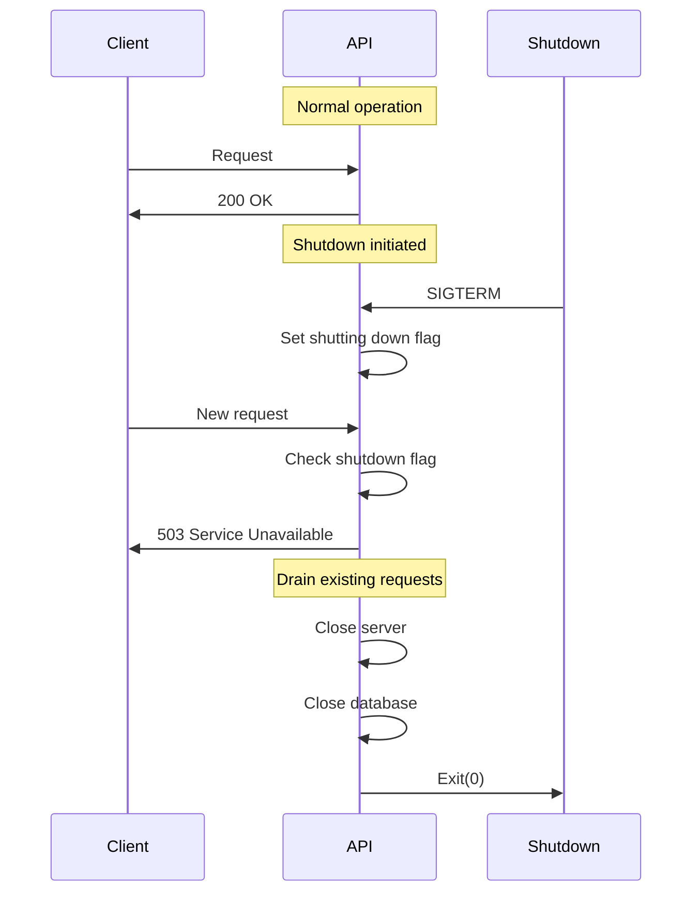
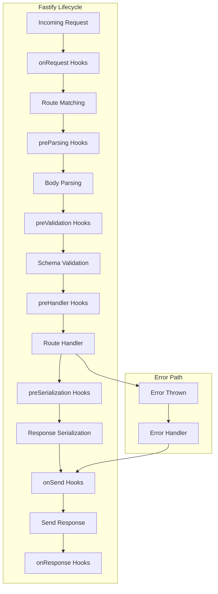

# Middleware Reference - USA Presence Calculator API

This document provides comprehensive documentation for all middleware functions used in the API, including their purpose, execution order, and implementation details.

## Table of Contents

1. [Middleware Overview](#middleware-overview)
2. [Request ID Middleware](#request-id-middleware)
3. [Shutdown Middleware](#shutdown-middleware)
4. [Authentication Middleware](#authentication-middleware)
5. [Error Handling Middleware](#error-handling-middleware)
6. [Middleware Execution Order](#middleware-execution-order)
7. [Custom Middleware Patterns](#custom-middleware-patterns)

## Middleware Overview

### Middleware Statistics

- **Core Middleware**: 3 (request-id, shutdown, error-handler)
- **Plugin-based Middleware**: 10 (via Fastify plugins)
- **Route-specific Middleware**: Variable (authentication on protected routes)

### Middleware vs Plugins

In Fastify, most functionality is implemented as plugins rather than traditional middleware:

| Type           | Implementation   | Purpose                |
| -------------- | ---------------- | ---------------------- |
| **Middleware** | Hook functions   | Request processing     |
| **Plugins**    | Fastify plugins  | Feature encapsulation  |
| **Decorators** | Instance methods | Reusable functionality |

## Request ID Middleware

**File**: `src/middleware/request-id.ts`

**Type**: Plugin with onRequest hook

**Purpose**: Generate or propagate unique request identifiers for tracking and debugging.

### Implementation

```typescript
import { createId } from '@paralleldrive/cuid2';
import { FastifyInstance } from 'fastify';
import fp from 'fastify-plugin';

export const requestIdPlugin = fp(
  (fastify: FastifyInstance) => {
    fastify.addHook('onRequest', (request, reply, done) => {
      // Check for existing ID from load balancer or proxy
      const existingId = request.headers['x-request-id'] || request.headers['x-correlation-id'];

      // Use existing ID or generate new one
      request.id = typeof existingId === 'string' ? existingId : createId();

      // Add request ID to response headers
      reply.header('x-request-id', request.id);

      done();
    });
  },
  {
    name: 'request-id',
  },
);
```

### Features

- **ID Generation**: Uses CUID2 for collision-resistant unique IDs
- **ID Propagation**: Respects existing IDs from upstream services
- **Header Support**: Checks both `X-Request-ID` and `X-Correlation-ID`
- **Response Header**: Always includes ID in response

### Usage

```typescript
// Automatically applied to all requests
// Access in handlers:
fastify.get('/example', async (request, reply) => {
  console.log('Request ID:', request.id);
  // Use in logging, error tracking, etc.
});
```

## Shutdown Middleware

**File**: `src/middleware/shutdown.ts`

**Type**: preHandler hook

**Purpose**: Reject new requests during graceful shutdown to ensure clean termination.

### Implementation

```typescript
import { FastifyReply, FastifyRequest } from 'fastify';
import { HTTP_STATUS } from '@api/constants/http';
import { isAppShuttingDown } from '@api/utils/graceful-shutdown';

export async function shutdownMiddleware(
  request: FastifyRequest,
  reply: FastifyReply,
): Promise<void> {
  if (isAppShuttingDown()) {
    request.log.warn('Request rejected during shutdown');
    await reply.code(HTTP_STATUS.SERVICE_UNAVAILABLE).header('Connection', 'close').send({
      error: 'Service Unavailable',
      message: 'Server is shutting down',
      code: 'SERVER_SHUTTING_DOWN',
    });
  }
  // Continue to next handler if not shutting down
}
```

### Features

- **Graceful Rejection**: Returns 503 during shutdown
- **Connection Closing**: Sets `Connection: close` header
- **Logging**: Warns about rejected requests
- **Non-blocking**: Only intercepts during shutdown

### Shutdown Flow



## Authentication Middleware

**File**: `src/plugins/require-auth.ts`

**Type**: Plugin with preHandler decorator

**Purpose**: Validate JWT tokens and inject user context into requests.

### Implementation

```typescript
declare module 'fastify' {
  interface FastifyInstance {
    requireAuth: preHandlerHookHandler;
  }

  interface FastifyRequest {
    user?: {
      userId: string;
      email: string;
      sessionId: string;
    };
  }
}

async function requireAuthHandler(request: FastifyRequest, reply: FastifyReply): Promise<void> {
  try {
    // Extract token from header
    const authHeader = request.headers.authorization;
    if (!authHeader?.startsWith('Bearer ')) {
      throw new Error('No token provided');
    }

    const token = authHeader.slice(7);

    // Verify JWT
    const payload = jwt.verify(token, config.JWT_SECRET) as TokenPayload;

    // Check token type
    if (payload.type !== 'access') {
      throw new Error('Invalid token type');
    }

    // Get user and session
    const session = await getSession(payload.jti);
    if (!session) {
      throw new Error('Session not found');
    }

    // Attach user context
    request.user = {
      userId: payload.sub,
      email: session.email,
      sessionId: session.id,
    };
  } catch (error) {
    reply.code(401).send({
      error: {
        message: 'Authentication required',
        code: 'AUTHENTICATION_REQUIRED',
      },
    });
  }
}
```

### Usage

```typescript
// Apply to specific routes
fastify.get('/protected', {
  preHandler: fastify.requireAuth,
  handler: async (request, reply) => {
    // request.user is guaranteed to exist
    const { userId, email } = request.user;
    // ...
  },
});

// Apply to all routes in a plugin
fastify.register(async function protectedRoutes(fastify) {
  fastify.addHook('preHandler', fastify.requireAuth);

  // All routes here require authentication
  fastify.get('/profile', getProfile);
  fastify.post('/settings', updateSettings);
});
```

### Token Validation

1. **Format Check**: Must be `Bearer <token>`
2. **JWT Verification**: Valid signature and not expired
3. **Token Type**: Must be `access` token
4. **Session Check**: Session must exist and be valid
5. **User Injection**: Adds user context to request

## Error Handling Middleware

**File**: `src/utils/global-error-handler.ts`

**Type**: Global error handler

**Purpose**: Centralized error handling with consistent formatting and logging.

### Implementation

```typescript
import { FastifyError, FastifyReply, FastifyRequest } from 'fastify';

export function createGlobalErrorHandler(): FastifyErrorHandler {
  return function globalErrorHandler(
    error: FastifyError,
    request: FastifyRequest,
    reply: FastifyReply,
  ): void {
    // Log error with context
    request.log.error({
      err: error,
      requestId: request.id,
      userId: request.user?.userId,
      method: request.method,
      url: request.url,
    });

    // Handle validation errors
    if (error.validation) {
      return reply.code(400).send({
        error: {
          message: 'Validation failed',
          code: 'VALIDATION_ERROR',
          details: error.validation,
          requestId: request.id,
        },
      });
    }

    // Handle known application errors
    if (error instanceof AppError) {
      return reply.code(error.statusCode).send({
        error: {
          message: error.message,
          code: error.code,
          details: error.details,
          requestId: request.id,
        },
      });
    }

    // Handle Fastify errors
    if (error.statusCode) {
      return reply.code(error.statusCode).send({
        error: {
          message: error.message,
          code: error.code || 'FASTIFY_ERROR',
          requestId: request.id,
        },
      });
    }

    // Default error response
    const statusCode = error.statusCode || 500;
    const message = statusCode === 500 ? 'Internal server error' : error.message;

    reply.code(statusCode).send({
      error: {
        message,
        code: 'INTERNAL_ERROR',
        requestId: request.id,
        timestamp: new Date().toISOString(),
      },
    });
  };
}
```

### Error Categories

1. **Validation Errors** (400)

   - Zod validation failures
   - Custom validation errors
   - Includes detailed error information

2. **Application Errors** (Various)

   - Custom AppError instances
   - Specific status codes and error codes
   - Business logic errors

3. **Fastify Errors** (Various)

   - Route not found (404)
   - Method not allowed (405)
   - Payload too large (413)

4. **Unexpected Errors** (500)
   - Unhandled exceptions
   - Database errors
   - External service failures

### Error Response Format

```typescript
interface ErrorResponse {
  error: {
    message: string; // Human-readable message
    code?: string; // Machine-readable code
    details?: unknown; // Additional error details
    requestId: string; // Request tracking ID
    timestamp?: string; // Error timestamp
  };
}
```

## Middleware Execution Order

### Complete Request Lifecycle



### Middleware Registration Order

```typescript
// 1. Core Infrastructure (Early)
await app.register(requestIdPlugin); // First: ID generation
await app.register(loggerPlugin); // Second: Logging setup
await app.register(requestContextPlugin); // Third: Context tracking

// 2. Security (Before Routes)
await app.register(corsPlugin); // CORS headers
await app.register(helmetPlugin); // Security headers

// 3. Authentication (Before Protected Routes)
await app.register(requireAuthPlugin); // Auth decorator

// 4. Request Processing
await app.register(timeoutPlugin); // Timeout management

// 5. Global Hooks
app.addHook('preHandler', shutdownMiddleware);

// 6. Rate Limiting (Before Routes)
await app.register(rateLimitPlugin);

// 7. Error Handling (After Plugins)
app.setErrorHandler(createGlobalErrorHandler());

// 8. Routes (Last)
await app.register(routes);
```

## Custom Middleware Patterns

### Route-Specific Middleware

```typescript
// Single route middleware
fastify.get('/admin/users', {
  preHandler: [
    fastify.requireAuth,
    requireAdmin, // Custom admin check
    auditLog, // Audit logging
  ],
  handler: listUsers,
});
```

### Conditional Middleware

```typescript
// Apply middleware based on conditions
function conditionalAuth(
  request: FastifyRequest,
  reply: FastifyReply,
  done: HookHandlerDoneFunction,
): void {
  // Skip auth for public endpoints
  if (request.url.startsWith('/public')) {
    return done();
  }

  // Apply auth for other routes
  fastify.requireAuth(request, reply, done);
}
```

### Async Middleware

```typescript
// Async middleware with proper error handling
async function asyncMiddleware(request: FastifyRequest, reply: FastifyReply): Promise<void> {
  try {
    // Async operation
    const result = await someAsyncOperation();

    // Attach to request
    request.asyncData = result;
  } catch (error) {
    // Let error handler catch it
    throw new AppError('Async operation failed', 500);
  }
}
```

### Middleware Composition

```typescript
// Compose multiple middleware
function composeMiddleware(...middlewares: preHandlerHookHandler[]): preHandlerHookHandler[] {
  return middlewares;
}

// Usage
fastify.get('/complex', {
  preHandler: composeMiddleware(
    fastify.requireAuth,
    validatePermissions('read:trips'),
    enrichUserContext,
    checkRateLimit,
  ),
  handler: complexHandler,
});
```

### Performance Middleware

```typescript
// Track request performance
function performanceMiddleware(
  request: FastifyRequest,
  reply: FastifyReply,
  done: HookHandlerDoneFunction,
): void {
  const start = process.hrtime.bigint();

  // Track response time
  reply.addHook('onSend', (req, res, payload, done) => {
    const duration = Number(process.hrtime.bigint() - start) / 1e6;
    res.header('X-Response-Time', `${duration}ms`);
    done();
  });

  done();
}
```

---

Last updated: January 2025
