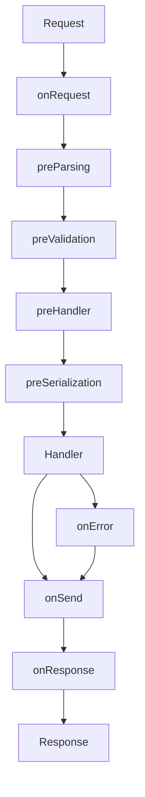

# Fastify Plugins Reference - USA Presence Calculator API

This document provides comprehensive documentation for all Fastify plugins used in the API, including configuration, lifecycle hooks, and custom decorators.

## Table of Contents

1. [Plugin Overview](#plugin-overview)
2. [Core Infrastructure Plugins](#core-infrastructure-plugins)
3. [Security Plugins](#security-plugins)
4. [API Feature Plugins](#api-feature-plugins)
5. [Plugin Registration Order](#plugin-registration-order)
6. [Custom Decorators Reference](#custom-decorators-reference)
7. [Hook Lifecycle](#hook-lifecycle)

## Plugin Overview

### Plugin Statistics

- **Total Plugins**: 13
- **Core Infrastructure**: 5 (request-id, logger, request-context, timeout, error-handler)
- **Security**: 4 (cors, helmet, rate-limit, require-auth)
- **API Features**: 4 (api-versioning, swagger, shutdown, graceful-shutdown)

### Plugin Categories

| Category           | Plugins                                | Purpose                          |
| ------------------ | -------------------------------------- | -------------------------------- |
| **Infrastructure** | request-id, logger, request-context    | Request tracking and logging     |
| **Security**       | cors, helmet, rate-limit, require-auth | Security layers and protection   |
| **API Management** | api-versioning, swagger                | API documentation and versioning |
| **Reliability**    | timeout, shutdown, error-handler       | Resilience and error handling    |

## Core Infrastructure Plugins

### Request ID Plugin

**File**: `src/middleware/request-id.ts`

**Purpose**: Generates unique request identifiers for tracking and correlation.

**Configuration**:

```typescript
// No configuration required
await fastify.register(requestIdPlugin);
```

**Features**:

- Generates CUID2 IDs for each request
- Supports correlation ID propagation via headers
- Adds `X-Request-ID` to response headers

**Hook Lifecycle**:

```typescript
onRequest: (request, reply, done) => {
  // Check for existing ID in headers
  const existingId = request.headers['x-request-id'] || request.headers['x-correlation-id'];

  // Use existing or generate new
  request.id = existingId || createId();

  // Add to response headers
  reply.header('x-request-id', request.id);
  done();
};
```

### Logger Plugin

**File**: `src/plugins/logger.ts`

**Purpose**: Structured logging with request/response tracking.

**Configuration**:

```typescript
// Configured via environment variables
LOG_LEVEL = 'info' | 'debug' | 'warn' | 'error';
NODE_ENV = 'development' | 'production' | 'test';
```

**Features**:

- Pino logger with pretty printing in development
- Log rotation in production
- Request/response body logging (with size limits)
- Sensitive data redaction
- Ignore patterns for health checks

**Constants**:

```typescript
LOG_IGNORE_ROUTES = ['/health', '/health/*', '/documentation/*'];
LOG_BODY_MAX_SIZE = 10000; // 10KB
LOG_REDACT_PATHS = ['password', 'token', 'authorization', 'refreshToken', 'accessToken', '*.token'];
```

**Hooks**:

- `onRequest`: Log request start
- `onResponse`: Log request completion with timing

### Request Context Plugin

**File**: `src/plugins/request-context.ts`

**Purpose**: Maintains request context throughout the lifecycle.

**Features**:

- Correlation ID tracking
- User context enrichment
- Request duration measurement
- Contextual logging helpers

**TypeScript Declaration**:

```typescript
declare module 'fastify' {
  interface FastifyRequest {
    context: RequestContext;
    startTime?: bigint;
  }
}

interface RequestContext {
  correlationId: string;
  requestId: string;
  userId?: string;
  userAgent?: string;
  ip?: string;
  method: string;
  path: string;
  timestamp: string;
  duration?: number;
}
```

**Decorators Added**:

- `fastify.getRequestContext(request)`: Get request context
- `fastify.withContext(context, fn)`: Execute with context

**Utility Functions**:

```typescript
// Extract context from request
extractContext(request: FastifyRequest): RequestContext

// Enrich context with additional data
enrichContext(request: FastifyRequest, additional: Partial<RequestContext>): void

// Get correlation ID
getCorrelationId(request: FastifyRequest): string

// Get request duration
getRequestDuration(request: FastifyRequest): number | undefined

// Contextual logging
logWithContext(request, level, message, additional?): void
createContextualLogger(request): Logger
```

### Timeout Plugin

**File**: `src/plugins/timeout.ts`

**Purpose**: Request timeout management with route-specific configurations.

**Configuration**:

```typescript
REQUEST_TIMEOUTS = {
  DEFAULT: 30000, // 30 seconds
  FAST: 5000, // 5 seconds
  STANDARD: 30000, // 30 seconds
  LONG: 60000, // 1 minute
  UPLOAD: 300000, // 5 minutes
};

ROUTE_TIMEOUTS = {
  '/health': REQUEST_TIMEOUTS.FAST,
  '/api/v1/sync/pull': REQUEST_TIMEOUTS.LONG,
  '/api/v1/sync/push': REQUEST_TIMEOUTS.LONG,
};
```

**Features**:

- Automatic timeout handling
- Route-specific timeout configuration
- Graceful timeout responses
- Timeout cleanup on response

**Error Response**:

```json
{
  "error": {
    "message": "Request timeout",
    "code": "REQUEST_TIMEOUT",
    "requestId": "req_123456",
    "timestamp": "2024-01-15T10:30:00.000Z"
  }
}
```

## Security Plugins

### CORS Plugin

**File**: `src/plugins/cors.ts`

**Purpose**: Cross-Origin Resource Sharing configuration.

**Configuration**:

```typescript
const corsOptions = {
  origin: (origin, callback) => {
    // Development: allow all
    if (NODE_ENV === 'development') {
      return callback(null, true);
    }

    // Production: whitelist check
    if (ALLOWED_ORIGINS.includes(origin)) {
      callback(null, true);
    } else {
      callback(new Error('Not allowed by CORS'));
    }
  },
  credentials: true,
  methods: ['GET', 'POST', 'PUT', 'PATCH', 'DELETE', 'OPTIONS'],
  allowedHeaders: ['Content-Type', 'Authorization', 'X-Request-ID', 'X-Correlation-ID'],
  exposedHeaders: [
    'X-Request-ID',
    'X-Correlation-ID',
    'X-RateLimit-Limit',
    'X-RateLimit-Remaining',
    'X-RateLimit-Reset',
  ],
  maxAge: 86400, // 24 hours
};
```

### Helmet Plugin

**File**: `src/plugins/helmet.ts`

**Purpose**: Security headers for protection against common attacks.

**Configuration**:

```typescript
// Production configuration
HELMET_CONFIG.PRODUCTION = {
  contentSecurityPolicy: {
    directives: {
      defaultSrc: ["'self'"],
      scriptSrc: ["'self'"],
      styleSrc: ["'self'", 'https:', "'unsafe-inline'"],
      imgSrc: ["'self'", 'data:', 'https:'],
      connectSrc: ["'self'"],
      fontSrc: ["'self'", 'https:', 'data:'],
      objectSrc: ["'none'"],
      mediaSrc: ["'self'"],
      frameSrc: ["'self'"],
    },
  },
  hsts: {
    maxAge: 63072000, // 2 years
    includeSubDomains: true,
    preload: true,
  },
  frameguard: { action: 'deny' },
  hidePoweredBy: true,
  noSniff: true,
  xssFilter: true,
  referrerPolicy: { policy: 'strict-origin-when-cross-origin' },
};
```

**Headers Set**:

- `Strict-Transport-Security`: HSTS enforcement
- `X-Frame-Options`: Clickjacking protection
- `X-Content-Type-Options`: MIME type sniffing prevention
- `Content-Security-Policy`: XSS and injection protection
- `Referrer-Policy`: Referrer information control
- `X-XSS-Protection`: Legacy XSS protection

### Rate Limit Plugin

**File**: `src/plugins/rate-limit.ts`

**Purpose**: Prevent abuse and ensure fair usage.

**Configuration**:

```typescript
RATE_LIMIT = {
  AUTH_ENDPOINTS: {
    WINDOW_MS: 15 * 60 * 1000, // 15 minutes
    MAX_REQUESTS: 5,
  },
  API_ENDPOINTS: {
    WINDOW_MS: 60 * 1000, // 1 minute
    MAX_REQUESTS_AUTHENTICATED: 100,
    MAX_REQUESTS_UNAUTHENTICATED: 20,
  },
  GLOBAL: {
    WINDOW_MS: 15 * 60 * 1000, // 15 minutes
    MAX_REQUESTS: 1000,
  },
};
```

**Features**:

- User-specific rate limiting
- Endpoint-specific limits
- Graceful degradation
- Rate limit headers in responses

**Response Headers**:

```http
X-RateLimit-Limit: 100
X-RateLimit-Remaining: 95
X-RateLimit-Reset: 1642345678
```

**Error Response (429)**:

```json
{
  "error": {
    "message": "Too many requests, please try again later",
    "code": "RATE_LIMIT_EXCEEDED",
    "retryAfter": 60
  }
}
```

### Require Auth Plugin

**File**: `src/plugins/require-auth.ts`

**Purpose**: JWT authentication and session management.

**Configuration**:

```typescript
AUTH_CONFIG = {
  ACCESS_TOKEN_EXPIRY: '15m',
  REFRESH_TOKEN_EXPIRY: '30d',
  JWT_ALGORITHM: 'HS256',
};
```

**Features**:

- JWT token validation
- User context injection
- Session verification
- Token refresh support

**Decorator Added**:

```typescript
fastify.decorate('requireAuth', preHandlerHook);
```

**Usage**:

```typescript
fastify.get('/protected', {
  preHandler: fastify.requireAuth,
  handler: async (request, reply) => {
    // request.user is available here
  },
});
```

**User Context**:

```typescript
declare module 'fastify' {
  interface FastifyRequest {
    user?: {
      userId: string;
      email: string;
      sessionId: string;
    };
  }
}
```

## API Feature Plugins

### API Versioning Plugin

**File**: `src/plugins/api-versioning.ts`

**Purpose**: API version management and routing.

**Configuration**:

```typescript
API_VERSION = {
  CURRENT: 'v1',
  PREFIX: '/api/v1',
  SUPPORTED_VERSIONS: ['v1'],
};

API_VERSIONING_CONFIG = {
  ENABLE_VERSION_HEADER: true,
  VERSION_HEADER_NAME: 'api-version',
  DEFAULT_VERSION: 'v1',
};
```

**Features**:

- URL path versioning
- Version header support
- Version validation
- Deprecation warnings

**Headers**:

```http
API-Version: v1
X-API-Deprecation-Warning: This version will be deprecated on 2025-01-01
```

### Swagger Plugin

**File**: `src/plugins/swagger.ts`

**Purpose**: API documentation via OpenAPI/Swagger.

**Configuration**:

```typescript
SWAGGER_CONFIG = {
  TITLE: 'USA Presence Calculator API',
  VERSION: '1.0.0',
  OPENAPI_VERSION: '3.0.3',
  UI_ROUTE: '/documentation',
};
```

**Features**:

- OpenAPI 3.0 specification
- Swagger UI interface
- Basic auth protection (production)
- Schema auto-generation

**Security** (Production Only):

```typescript
// Protected with basic auth
Username: process.env.SWAGGER_USERNAME;
Password: process.env.SWAGGER_PASSWORD;
```

## Plugin Registration Order

The order of plugin registration is critical for proper functionality:

```typescript
// 1. Request Infrastructure (must be first)
await app.register(requestIdPlugin);
await app.register(loggerPlugin);
await app.register(requestContextPlugin);

// 2. Security (early to protect all routes)
await app.register(corsPlugin);
await app.register(helmetPlugin);

// 3. Authentication (before routes)
await app.register(requireAuthPlugin);

// 4. Request Processing
await app.register(timeoutPlugin);

// 5. Middleware Hooks
app.addHook('preHandler', shutdownMiddleware);

// 6. Rate Limiting (before error handler)
await app.register(rateLimitPlugin);

// 7. Error Handling
app.setErrorHandler(createGlobalErrorHandler());

// 8. Documentation
await app.register(swaggerPlugin);

// 9. API Versioning
await app.register(apiVersioningPlugin);

// 10. Routes
await app.register(routes);
```

## Custom Decorators Reference

### Fastify Instance Decorators

```typescript
// Authentication
fastify.requireAuth: preHandlerHookHandler

// Request Context
fastify.getRequestContext(request: FastifyRequest): RequestContext
fastify.withContext<T>(context: RequestContext, fn: () => T): T

// Future decorators
fastify.cache: CacheService
fastify.metrics: MetricsService
```

### Request Decorators

```typescript
// Added by plugins
request.id: string              // Request ID
request.user?: AuthUser         // Authenticated user
request.context: RequestContext // Request context
request.startTime?: bigint      // Request start time
request.timeoutHandle?: Timeout // Timeout handle
```

### Reply Decorators

```typescript
// Standard Fastify decorators used
reply.header(name: string, value: string)
reply.code(statusCode: number)
reply.send(payload: any)
```

## Hook Lifecycle

### Complete Hook Execution Order



### Hook Responsibilities

1. **onRequest**:

   - Request ID generation
   - Logger initialization
   - Context creation
   - Timeout setup

2. **preParsing**:

   - Body size validation
   - Content type checking

3. **preValidation**:

   - Rate limit checking
   - API version validation

4. **preHandler**:

   - Authentication
   - Authorization
   - Shutdown checking

5. **Handler**:

   - Business logic execution
   - Database operations

6. **onSend**:

   - Response header addition
   - Correlation ID headers
   - Timeout cleanup

7. **onResponse**:

   - Response logging
   - Metrics recording
   - Duration calculation

8. **onError**:
   - Error formatting
   - Error logging
   - Timeout cleanup

---

Last updated: January 2025
