# USA Presence Calculator - Technical Architecture Documentation

## Executive Summary

The USA Presence Calculator is a sophisticated mobile application designed to help U.S. Lawful Permanent Residents (LPRs) track their physical presence and continuous residence requirements for naturalization eligibility. This document provides a comprehensive technical overview of the shared library (`@usa-presence/shared`), which forms the core business logic foundation for the entire application.

### Key Statistics
- **194 Total Functions** (145 exported, 49 internal)
- **89 Zod Schemas** with 1:1 TypeScript type mappings
- **42 Main Constants** with ~250+ individual values
- **650+ Test Cases** across 21 test files
- **9 Major Feature Areas** organized into logical modules

## Table of Contents
1. [System Architecture Overview](#system-architecture-overview)
2. [Core Business Domains](#core-business-domains)
3. [Data Flow Architecture](#data-flow-architecture)
4. [Key Algorithms and Calculations](#key-algorithms-and-calculations)
5. [Schema Design and Validation](#schema-design-and-validation)
6. [Module Organization](#module-organization)
7. [Technical Design Decisions](#technical-design-decisions)
8. [Integration Points](#integration-points)
9. [Testing Strategy](#testing-strategy)
10. [Performance Considerations](#performance-considerations)

## System Architecture Overview

### High-Level Architecture

```mermaid
graph TB
    subgraph "Client Layer"
        Mobile[Mobile App<br/>React Native/Expo]
        Web[Web Dashboard<br/>Future]
    end
    
    subgraph "Shared Business Logic"
        Core[@usa-presence/shared]
        Schemas[Zod Schemas]
        BL[Business Logic]
        Constants[Constants]
        Utils[Utilities]
    end
    
    subgraph "API Layer"
        API[NestJS API<br/>Optional Sync]
        DB[(PostgreSQL)]
    end
    
    Mobile --> Core
    Web --> Core
    Core --> Schemas
    Core --> BL
    Core --> Constants
    Core --> Utils
    Mobile -.-> API
    API --> DB
    
    style Core fill:#f9f,stroke:#333,stroke-width:4px
    style Mobile fill:#bbf,stroke:#333,stroke-width:2px
    style API fill:#bfb,stroke:#333,stroke-width:2px
```

### Core Design Principles

1. **Offline-First**: All calculations run locally without network dependency
2. **Type-Safe**: Zod schemas provide runtime validation and compile-time types
3. **USCIS Compliant**: Strict adherence to immigration law requirements
4. **Functional Programming**: Pure functions with no side effects
5. **UTC-First**: All date handling in UTC to avoid timezone issues

## Core Business Domains

### 1. Physical Presence Calculation

The most critical domain, handling USCIS day-counting rules for naturalization eligibility.


**Key Features:**
- USCIS-compliant day counting (departure/return days count as presence)
- Overlapping trip deduplication using Set data structure
- Continuous residence validation (180+ day trips)
- Early filing window calculation (90 days before eligibility)

### 2. Compliance Management System

Tracks five major compliance areas critical for LPRs:


### 3. LPR Status Risk Assessment

Advanced pattern analysis for frequent travelers:


### 4. Travel Analytics Engine

Provides insights and projections:


## Data Flow Architecture

### Overall Data Flow


### Calculation Pipeline


## Key Algorithms and Calculations

### 1. USCIS Day Counting Algorithm

```typescript
// Pseudocode representation
function calculateDaysAbroad(trip) {
    const tripDuration = endDate - startDate + 1
    
    // USCIS Rule: Departure and return days count as presence in USA
    if (departureDate !== returnDate) {
        return tripDuration - 2
    } else {
        return 0 // Same-day trip
    }
}
```

### 2. Overlapping Trip Deduplication


### 3. Risk Assessment Thresholds

```mermaid
graph LR
    subgraph "Risk Levels by Days Abroad"
        Safe[0-149 days<br/>✅ Safe]
        Warning[150-179 days<br/>⚠️ Warning]
        Presumption[180-364 days<br/>🔴 Presumption]
        Loss[365+ days<br/>❌ Automatic Loss]
    end
    
    Safe --> Warning
    Warning --> Presumption
    Presumption --> Loss
    
    subgraph "Mitigation"
        Permit[Reentry Permit<br/>Extends to 730 days]
        N470[N-470 Exemption<br/>Protects residence]
    end
    
    Presumption -.-> Permit
    Presumption -.-> N470
```



## Schema Design and Validation

### Zod Schema Architecture


### Schema Example: Trip Validation

```typescript
const TripSchema = z.object({
    departureDate: z.string().regex(/^\d{4}-\d{2}-\d{2}$/),
    returnDate: z.string().regex(/^\d{4}-\d{2}-\d{2}$/),
    location: z.string().optional(),
}).refine(
    data => new Date(data.returnDate) >= new Date(data.departureDate),
    { message: 'Return date must be after departure date' }
);
```

## Module Organization

### Directory Structure

```mermaid
graph TD
    subgraph "Shared Package Structure"
        Root[@usa-presence/shared]
        
        subgraph "Source"
            Schemas[schemas/]
            BL[business-logic/]
            Constants[constants/]
            Utils[utils/]
        end
        
        subgraph "Business Logic"
            Calc[calculations/]
            Presence[presence/]
            Compliance[compliance/]
            LPR[lpr-status/]
            Analytics[travel-analytics/]
            Risk[travel-risk/]
            Report[reporting/]
        end
    end
    
    Root --> Source
    BL --> Calc
    Calc --> Presence
    Calc --> Compliance
    Calc --> LPR
    Calc --> Analytics
    Calc --> Risk
    Calc --> Report
```

### Import Hierarchy


## Technical Design Decisions

### 1. UTC-First Date Handling

**Decision**: All dates stored and calculated in UTC

**Rationale**:
- Avoids timezone ambiguity
- Consistent calculations across timezones
- USCIS uses calendar days, not hours


### 2. Functional Programming Approach

**Decision**: Pure functions with no side effects

**Benefits**:
- Predictable behavior
- Easy testing
- Cacheable results
- Concurrent execution

### 3. Monorepo with Shared Package

**Decision**: Single shared package for all business logic

**Advantages**:
- Single source of truth
- Consistent calculations across platforms
- Easier maintenance
- Type safety across boundaries

## Integration Points

### Mobile App Integration


### API Integration (Optional Sync)


## Testing Strategy

### Test Coverage by Domain


### Testing Approach

1. **Unit Tests**: All exported functions have comprehensive tests
2. **Edge Cases**: 200+ specific edge case tests
3. **USCIS Compliance**: Validate against official rules
4. **Integration Tests**: Test complete calculation flows
5. **Performance Tests**: Large dataset handling

### Test Categories


## Performance Considerations

### Optimization Strategies

1. **Set-Based Deduplication**: O(n) instead of O(n²) for overlapping trips
2. **Early Validation**: Fail fast on invalid data
3. **Lazy Calculation**: Calculate only what's needed
4. **Memoization**: Cache expensive calculations
5. **Batch Processing**: Process multiple items together

### Performance Benchmarks


## Application Purpose and User Journey

### What the Application Does

The USA Presence Calculator helps Lawful Permanent Residents (green card holders) track their eligibility for U.S. citizenship by:

1. **Tracking Physical Presence**: Monitors days spent in the USA vs. abroad
2. **Ensuring Continuous Residence**: Warns about trips that could reset eligibility
3. **Managing Compliance**: Reminds about critical deadlines and requirements
4. **Assessing Risk**: Evaluates travel patterns for green card abandonment risk
5. **Providing Guidance**: Offers personalized recommendations and projections

### User Journey Flow


### Key User Scenarios

1. **New LPR**: Just received green card, wants to understand requirements
2. **Frequent Traveler**: Business traveler needing to maintain status
3. **Family Abroad**: Balancing US presence with family obligations
4. **Near Eligibility**: Approaching naturalization, needs precise tracking
5. **At Risk**: Extended absence, needs immediate guidance

## Security and Privacy

### Data Protection Measures


## Future Extensibility

### Planned Enhancements

1. **Multi-Language Support**: Expand beyond English/Spanish
2. **Family Tracking**: Support multiple family members
3. **Document Management**: Store travel documents
4. **AI Predictions**: Machine learning for better projections
5. **Legal Integration**: Direct attorney consultations

### Extension Points

```mermaid
graph TD
    subgraph "Current Core"
        Shared[Shared Library]
        Mobile[Mobile App]
    end
    
    subgraph "Future Extensions"
        Web[Web Dashboard]
        API[Sync API]
        ML[ML Service]
        Docs[Document Service]
        Legal[Legal Network]
    end
    
    Shared --> Web
    Shared --> API
    API --> ML
    API --> Docs
    API --> Legal
    
    style Shared fill:#f9f,stroke:#333,stroke-width:4px
    style Mobile fill:#bbf,stroke:#333,stroke-width:2px
    style Web stroke-dasharray: 5 5
    style API stroke-dasharray: 5 5
    style ML stroke-dasharray: 5 5
```

## Conclusion

The USA Presence Calculator's shared library represents a sophisticated implementation of complex immigration law requirements, delivered through clean architecture and robust engineering practices. By maintaining strict separation of concerns, comprehensive testing, and user-focused design, the system provides accurate, reliable guidance for one of life's most important journeys - the path to U.S. citizenship.

The architecture's strength lies in its:
- **Accuracy**: Strict USCIS compliance
- **Reliability**: Extensive testing and validation
- **Usability**: Complex rules made simple
- **Maintainability**: Clean, modular design
- **Extensibility**: Ready for future growth

This technical foundation ensures that users can trust the application with their immigration journey, providing peace of mind through precision and clarity.