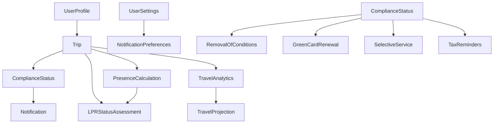

# Comprehensive Schema Reference - USA Presence Calculator Shared Package

This document is the complete reference for ALL Zod schemas and TypeScript types in the shared package, providing a centralized resource for understanding data structures, validation rules, and relationships.

## Summary Audit

### Overall Statistics

- **Total Schema Files**: 10
- **Total Zod Schemas**: 89 (all using `.strict()` mode)
- **Total TypeScript Types**: 89 (1:1 mapping with schemas)
- **Schema Categories**: 8 major categories
- **Common Validation Patterns**: 7
- **Security Enhancement**: All schemas use `.strict()` mode to reject unknown properties

### Schemas by Category

| Category                 | Schema Count | Primary Purpose                                     |
| ------------------------ | ------------ | --------------------------------------------------- |
| **Trip Management**      | 4            | Trip data, creation, updates, simulation            |
| **User Management**      | 3            | Profile, authentication, settings                   |
| **Compliance**           | 7            | Green card renewal, I-751, selective service, taxes |
| **Presence Calculation** | 10           | Physical presence, continuous residence, milestones |
| **LPR Status**           | 28           | Risk assessment, pattern analysis, permits          |
| **Travel Analytics**     | 15           | Statistics, projections, budget, summaries          |
| **Notifications**        | 2            | Notification data and preferences                   |
| **Utility Schemas**      | 20           | Helpers, options, requirements, outputs             |

## Table of Contents

1. [Core Business Schemas](#core-business-schemas)
   - [Trip Schemas](#trip-schemas)
   - [User Schemas](#user-schemas)
   - [Compliance Schemas](#compliance-schemas)
   - [Presence Schemas](#presence-schemas)
   - [LPR Status Schemas](#lpr-status-schemas)
   - [Travel Analytics Schemas](#travel-analytics-schemas)
   - [Notification Schemas](#notification-schemas)
2. [Utility & Helper Schemas](#utility--helper-schemas)
3. [Common Validation Rules](#common-validation-rules)
4. [Schema Relationships](#schema-relationships)
5. [Alphabetical Schema Index](#alphabetical-schema-index)
6. [Schemas by File](#schemas-by-file)

---

## Core Business Schemas

### Trip Schemas

**File**: `/schemas/trip.ts`

#### **TripSchema** _(Complete stored trip)_

```typescript
z.object({
  id: z.string().uuid(),
  userId: z.string().uuid(),
  departureDate: z.string().regex(/^\d{4}-\d{2}-\d{2}$/),
  returnDate: z.string().regex(/^\d{4}-\d{2}-\d{2}$/),
  location: z.string().optional(),
  isSimulated: z.boolean(),
  createdAt: z.string().datetime(),
  updatedAt: z.string().datetime(),
}).strict(); // Rejects any extra properties
```

**Validation**: Return date must be >= departure date
**Type**: `Trip`
**Security**: Uses `.strict()` mode - extra properties will be rejected

#### **TripCreateSchema** _(New trip creation)_

```typescript
{
  departureDate: z.string().regex(/^\d{4}-\d{2}-\d{2}$/),
  returnDate: z.string().regex(/^\d{4}-\d{2}-\d{2}$/),
  location: z.string().optional(),
}
```

**Validation**: Return date must be >= departure date
**Type**: `TripCreate`

#### **TripUpdateSchema** _(Partial update)_

- All fields from `TripCreateSchema` but optional
- Same date validation when both dates provided
  **Type**: `TripUpdate`

#### **SimulatedTripSchema** _(Travel simulator)_

```typescript
{
  departureDate: z.string().regex(/^\d{4}-\d{2}-\d{2}$/),
  returnDate: z.string().regex(/^\d{4}-\d{2}-\d{2}$/),
}
```

**Type**: `SimulatedTrip`

### User Schemas

**File**: `/schemas/user.ts`

#### **UserProfileSchema** _(Core user info)_

```typescript
{
  id: z.string().uuid(),
  email: z.string().email(),
  greenCardDate: z.string().regex(/^\d{4}-\d{2}-\d{2}$/),
  eligibilityCategory: z.enum(['three_year', 'five_year']),
  createdAt: z.string().datetime(),
  updatedAt: z.string().datetime(),
}
```

**Type**: `UserProfile`

#### **AuthUserSchema** _(OAuth provider info)_

```typescript
{
  id: z.string().uuid(),
  email: z.string().email(),
  providers: z.object({
    apple: z.string().optional(),
    google: z.string().optional(),
  }),
}
```

**Type**: `AuthUser`

#### **UserSettingsSchema** _(App preferences)_

```typescript
{
  notifications: z.object({
    milestones: z.boolean(),
    warnings: z.boolean(),
    reminders: z.boolean(),
  }),
  biometricAuthEnabled: z.boolean(),
  theme: z.enum(['light', 'dark', 'system']),
  language: z.enum(['en', 'es']),
}
```

**Type**: `UserSettings`

### Compliance Schemas

**File**: `/schemas/compliance.ts`

#### **RemovalOfConditionsStatusSchema** _(I-751 Status)_

```typescript
{
  applies: z.boolean(),
  greenCardDate: z.string(),
  filingWindowStart: z.string(),
  filingWindowEnd: z.string(),
  currentStatus: z.enum(['not_yet', 'in_window', 'filed', 'approved', 'overdue']),
  daysUntilWindow: z.number().nullable(),
  daysUntilDeadline: z.number().nullable(),
}
```

**Type**: `RemovalOfConditionsStatus`

#### **GreenCardRenewalStatusSchema**

```typescript
{
  expirationDate: z.string(),
  renewalWindowStart: z.string(),
  currentStatus: z.enum(['valid', 'renewal_recommended', 'renewal_urgent', 'expired']),
  monthsUntilExpiration: z.number(),
  isInRenewalWindow: z.boolean(),
}
```

**Type**: `GreenCardRenewalStatus`

#### **SelectiveServiceStatusSchema**

```typescript
{
  applies: z.boolean(),
  registrationRequired: z.boolean(),
  registrationDeadline: z.string().nullable(),
  isRegistered: z.boolean(),
  currentStatus: z.enum(['not_applicable', 'must_register', 'registered', 'aged_out']),
}
```

**Type**: `SelectiveServiceStatus`

#### **TaxReminderStatusSchema**

```typescript
{
  nextDeadline: z.string(),
  daysUntilDeadline: z.number(),
  isAbroadDuringTaxSeason: z.boolean(),
  reminderDismissed: z.boolean(),
  applicableDeadline: z.enum(['standard', 'abroad_extension', 'october_extension']),
  actualDeadline: z.string(),
}
```

**Type**: `TaxReminderStatus`

#### **ComprehensiveComplianceStatusSchema**

```typescript
{
  removalOfConditions: RemovalOfConditionsStatusSchema.nullable(),
  greenCardRenewal: GreenCardRenewalStatusSchema,
  selectiveService: SelectiveServiceStatusSchema,
  taxReminders: TaxReminderStatusSchema,
}
```

**Type**: `ComprehensiveComplianceStatus`

#### **ComplianceCalculationParamsSchema**

```typescript
{
  isConditionalResident: z.boolean(),
  greenCardDate: z.string(),
  greenCardExpirationDate: z.string(),
  birthDate: z.string(),
  gender: z.enum(['male', 'female', 'other']),
  isSelectiveServiceRegistered: z.boolean(),
  taxReminderDismissed: z.boolean(),
  trips: z.array(TripSchema),
  currentDate: z.string().optional(),
}
```

**Type**: `ComplianceCalculationParams`

#### **ComplianceStatusSchema**

```typescript
{
  overallStatus: z.enum(['compliant', 'action_required', 'at_risk']),
  items: z.array(ComplianceItemSchema),
  lastUpdated: z.string().datetime(),
}
```

**Type**: `ComplianceStatus`

### Presence Schemas

**File**: `/schemas/presence.ts`

#### **PresenceCalculationSchema** _(Main calculation result)_

```typescript
{
  totalDaysInUSA: z.number().int().nonnegative(),
  totalDaysAbroad: z.number().int().nonnegative(),
  requiredDays: z.number().int().positive(),
  percentageComplete: z.number().min(0).max(100),
  daysRemaining: z.number().int().nonnegative(),
  eligibilityDate: z.string().regex(/^\d{4}-\d{2}-\d{2}$/),
  earliestFilingDate: z.string().regex(/^\d{4}-\d{2}-\d{2}$/),
}
```

**Type**: `PresenceCalculation`

#### **PresenceStatusSchema**

```typescript
{
  status: z.enum(['on_track', 'at_risk', 'requirement_met']),
  message: z.string(),
}
```

**Type**: `PresenceStatus`

#### **ContinuousResidenceWarningSchema**

```typescript
{
  tripId: z.string().uuid(),
  daysAbroad: z.number().int().positive(),
  threshold: z.number().int().positive(),
  message: z.string(),
  severity: z.enum(['low', 'medium', 'high']),
}
```

**Type**: `ContinuousResidenceWarning`

#### **ContinuousResidenceResultSchema**

```typescript
{
  maintained: z.boolean(),
  warnings: z.array(ContinuousResidenceWarningSchema),
}
```

**Type**: `ContinuousResidenceResult`

#### **EligibilityDatesSchema**

```typescript
{
  eligibilityDate: z.string().regex(/^\d{4}-\d{2}-\d{2}$/),
  earliestFilingDate: z.string().regex(/^\d{4}-\d{2}-\d{2}$/),
  canFileEarly: z.boolean(),
}
```

**Type**: `EligibilityDates`

#### **EligibilityMilestoneSchema**

```typescript
{
  type: z.enum([
    'presence_requirement_met',
    'filing_window_open',
    'one_year_remaining',
    'six_months_remaining'
  ]),
  achievedDate: z.string().regex(/^\d{4}-\d{2}-\d{2}$/),
  message: z.string(),
}
```

**Type**: `EligibilityMilestone`

#### **DateValidationResultSchema**

```typescript
{
  greenCardDateObj: z.date(),
  asOfDateObj: z.date(),
  daysSinceGreenCard: z.number().int().positive(),
}
```

**Type**: `DateValidationResult`

#### **PresenceCalculationInputSchema**

```typescript
{
  trips: z.array(TripSchema),
  greenCardDate: z.string().regex(/^\d{4}-\d{2}-\d{2}$/),
  eligibilityCategory: z.enum(['three_year', 'five_year']),
  currentDate: z.string().regex(/^\d{4}-\d{2}-\d{2}$/).optional(),
}
```

**Type**: `PresenceCalculationInput`

#### **PresenceCalculationOutputSchema**

```typescript
{
  calculation: PresenceCalculationSchema,
  status: PresenceStatusSchema,
  continuousResidence: ContinuousResidenceResultSchema,
  eligibilityDates: EligibilityDatesSchema,
  milestones: z.array(EligibilityMilestoneSchema),
}
```

**Type**: `PresenceCalculationOutput`

### LPR Status Schemas

**File**: `/schemas/lpr-status.ts`

#### **Status Enums**

- **I751StatusSchema**: `['not_applicable', 'pending', 'approved', 'denied']`
- **LPRStatusTypeSchema**: `['permanent', 'conditional']`
- **N470StatusSchema**: `['none', 'approved', 'pending']`
- **ReentryPermitStatusSchema**: `['none', 'pending', 'approved', 'expired']`

#### **Risk Level Enums**

- **LPRRiskLevelSchema**: Basic risk levels
- **ComprehensiveRiskLevelSchema**: Includes permit protection levels
- **TravelRiskLevelSchema**: Extended with severity levels

#### **LPRStatusAssessmentSchema** _(Basic assessment)_

```typescript
{
  overallRisk: z.enum(['low', 'medium', 'high', 'severe']),
  longestTrip: LongestTripInfoSchema.nullable(),
  recommendations: z.array(z.string()),
}
```

**Type**: `LPRStatusAssessment`

#### **AdvancedLPRStatusParamsSchema**

```typescript
{
  trips: z.array(TripSchema),
  greenCardDate: z.string(),
  asOfDate: z.string().optional(),
  isConditionalResident: z.boolean().optional(),
  hasReentryPermit: z.boolean().optional(),
  reentryPermitExpiryDate: z.string().optional(),
  hasN470: z.boolean().optional(),
  n470ApprovalDate: z.string().optional(),
  employmentAbroad: z.boolean().optional(),
  familyInUS: z.boolean().optional(),
  propertyInUS: z.boolean().optional(),
  taxReturns: z.boolean().optional(),
}
```

**Type**: `AdvancedLPRStatusParams`

#### **LPRStatusAssessmentAdvancedSchema** _(Comprehensive assessment)_

```typescript
{
  overallRisk: ComprehensiveRiskLevelSchema,
  riskFactors: RiskFactorsSchema,
  analysis: AnalysisSchema,
  currentStatus: CurrentLPRStatusSchema,
  recommendations: z.array(z.string()),
}
```

**Type**: `LPRStatusAssessmentAdvanced`

#### **PatternOfNonResidenceSchema**

```typescript
{
  hasPattern: z.boolean(),
  factors: z.array(z.string()),
  recommendation: z.string(),
}
```

**Type**: `PatternOfNonResidence`

#### **RebuttablePresumptionSchema**

```typescript
{
  triggered: z.boolean(),
  daysAbroad: z.number(),
  canRebut: z.boolean(),
  factors: z.array(z.string()),
}
```

**Type**: `RebuttablePresumption`

### Travel Analytics Schemas

**File**: `/schemas/travel-analytics.ts`

#### **CountryStatisticsSchema**

```typescript
{
  country: z.string(),
  totalDays: z.number().int().nonnegative(),
  tripCount: z.number().int().nonnegative(),
  averageDaysPerTrip: z.number().nonnegative(),
  lastVisitDate: z.string().regex(/^\d{4}-\d{2}-\d{2}$/),
}
```

**Type**: `CountryStatistics`

#### **YearlyDaysAbroadSchema**

```typescript
{
  year: z.number().int(),
  daysAbroad: z.number().int().nonnegative(),
  tripCount: z.number().int().nonnegative(),
  trips: z.array(TripSchema),
}
```

**Type**: `YearlyDaysAbroad`

#### **TravelStreakSchema**

```typescript
{
  type: z.enum(['in_usa', 'traveling', 'travel_free_months']),
  startDate: z.string().regex(/^\d{4}-\d{2}-\d{2}$/),
  endDate: z.string().regex(/^\d{4}-\d{2}-\d{2}$/),
  duration: z.number().int().positive(),
  description: z.string(),
}
```

**Type**: `TravelStreak`

#### **MilestoneInfoSchema**

```typescript
{
  type: z.string(),
  label: z.string(),
  date: z.string().regex(/^\d{4}-\d{2}-\d{2}$/),
  daysRemaining: z.number().int(),
  description: z.string(),
  icon: z.string(),
  isAchieved: z.boolean(),
  progress: z.number().min(0).max(100),
}
```

**Type**: `MilestoneInfo`

#### **SafeTravelBudgetSchema**

```typescript
{
  totalBudgetDays: z.number().int().nonnegative(),
  usedDays: z.number().int().nonnegative(),
  remainingDays: z.number().int().nonnegative(),
  dailyAverage: z.number().nonnegative(),
  projectedExcessDays: z.number().int(),
  risk: z.enum(['low', 'medium', 'high']),
  recommendations: z.array(z.string()),
}
```

**Type**: `SafeTravelBudget`

#### **TravelProjectionSchema**

```typescript
{
  projectedEligibilityDate: z.string().regex(/^\d{4}-\d{2}-\d{2}$/).nullable(),
  daysUntilEligible: z.number().int().nullable(),
  confidence: z.enum(['high', 'medium', 'low']),
  assumptions: z.object({
    historicalAbsenceRate: z.number().nullable(),
    projectedAbsenceRate: z.number().nullable(),
    dataPointsUsed: z.number().int(),
  }),
  warnings: z.array(z.string()),
}
```

**Type**: `TravelProjection`

#### **TripRiskAssessmentSchema**

```typescript
{
  tripId: z.string().uuid(),
  departureDate: z.string().regex(/^\d{4}-\d{2}-\d{2}$/),
  returnDate: z.string().regex(/^\d{4}-\d{2}-\d{2}$/),
  daysAbroad: z.number().int().positive(),
  cumulativeDaysAbroad: z.number().int().nonnegative(),
  presenceRisk: TravelRiskLevelSchema,
  greenCardRisk: TravelRiskLevelSchema,
  warnings: z.array(z.string()),
  recommendations: z.array(z.string()),
}
```

**Type**: `TripRiskAssessment`

#### **AnnualTravelSummarySchema**

```typescript
{
  year: z.number().int(),
  metrics: YearSummaryMetricsSchema,
  topDestinations: z.array(DestinationSummarySchema),
  comparison: YearComparisonSchema.nullable(),
  insights: z.array(z.string()),
}
```

**Type**: `AnnualTravelSummary`

### Notification Schemas

**File**: `/schemas/notification.ts`

#### **NotificationSchema**

```typescript
{
  id: z.string().uuid(),
  userId: z.string().uuid(),
  type: z.enum(['milestone', 'warning', 'reminder', 'celebration']),
  title: z.string(),
  body: z.string(),
  data: z.record(z.unknown()).optional(),
  read: z.boolean(),
  createdAt: z.string().datetime(),
}
```

**Type**: `Notification`

#### **NotificationPreferencesSchema**

```typescript
{
  milestones: z.boolean(),
  warnings: z.boolean(),
  reminders: z.boolean(),
  celebrations: z.boolean(),
  pushEnabled: z.boolean(),
  emailEnabled: z.boolean(),
}
```

**Type**: `NotificationPreferences`

---

## Utility & Helper Schemas

### Calculation Helpers

**File**: `/schemas/calculation-helpers.ts`

#### **TripDurationOptionsSchema**

```typescript
{
  includeDepartureDay: z.boolean().optional(),
  includeReturnDay: z.boolean().optional(),
  startBoundary: z.date().optional(),
  endBoundary: z.date().optional(),
}
```

**Type**: `TripDurationOptions`

#### **TripValidationRequirementsSchema**

```typescript
{
  needsId: z.boolean().optional(),
  needsLocation: z.boolean().optional(),
  allowSimulated: z.boolean().optional(),
  checkDates: z.boolean().optional(),
}
```

**Type**: `TripValidationRequirements`

### Compliance Helpers

**File**: `/schemas/compliance-helpers.ts`

#### **ActiveComplianceItemSchema**

```typescript
{
  type: z.nativeEnum(COMPLIANCE_ITEM_TYPE),
  description: z.string(),
  urgency: z.nativeEnum(PRIORITY_LEVEL),
}
```

**Type**: `ActiveComplianceItem`

#### **PriorityComplianceItemSchema**

```typescript
{
  type: z.nativeEnum(COMPLIANCE_ITEM_TYPE),
  description: z.string(),
  deadline: z.string(),
  priority: z.nativeEnum(PRIORITY_LEVEL),
}
```

**Type**: `PriorityComplianceItem`

#### **UpcomingDeadlineSchema**

```typescript
{
  type: z.nativeEnum(COMPLIANCE_ITEM_TYPE),
  description: z.string(),
  date: z.string(),
  daysRemaining: z.number(),
}
```

**Type**: `UpcomingDeadline`

### Travel Analytics Helpers

**File**: `/schemas/travel-analytics-helpers.ts`

#### **CountryDataSchema**

```typescript
{
  totalDays: z.number(),
  tripCount: z.number(),
  lastVisitDate: z.date().nullable(),
}
```

**Type**: `CountryData`

#### **TripDateRangeSchema**

```typescript
{
  departure: z.date(),
  returnDate: z.date(),
}
```

**Type**: `TripDateRange`

#### **YearBoundariesSchema**

```typescript
{
  yearStart: z.date(),
  yearEnd: z.date(),
  effectiveStart: z.date(),
  effectiveEnd: z.date(),
}
```

**Type**: `YearBoundaries`

---

## Common Validation Rules

### Security: Strict Mode

- **All schemas use `.strict()` mode**
- **Behavior**: Rejects any properties not explicitly defined in the schema
- **Purpose**: Prevents prototype pollution and injection attacks
- **Example**: Extra properties in input will cause validation to fail

### 1. Date Format Validation

- **Pattern**: `/^\d{4}-\d{2}-\d{2}$/`
- **Format**: `YYYY-MM-DD`
- **Used in**: All date string fields
- **Example**: `"2024-01-15"`

### 2. UUID Validation

- **Method**: `.uuid()`
- **Format**: Standard UUID v4
- **Used in**: All `id` and `userId` fields
- **Example**: `"550e8400-e29b-41d4-a716-446655440000"`

### 3. Email Validation

- **Method**: `.email()`
- **Used in**: User email fields
- **Example**: `"user@example.com"`

### 4. Datetime Validation

- **Method**: `.datetime()`
- **Format**: ISO 8601
- **Used in**: Timestamps (`createdAt`, `updatedAt`)
- **Example**: `"2024-01-15T10:30:00Z"`

### 5. Number Constraints

- **`.int()`**: Integer values only
- **`.nonnegative()`**: >= 0
- **`.positive()`**: > 0
- **`.min(n)`/`.max(n)`**: Range constraints

### 6. String Constraints

- **`.min(n)`/`.max(n)`**: Length constraints
- **`.regex(pattern)`**: Pattern matching
- **`.trim()`**: Remove whitespace

### 7. Enum Validation

- **`.enum([...])`**: Strict value list
- **`.nativeEnum(CONSTANT)`**: TypeScript enum

---

## Schema Relationships



### Key Relationships:

1. **User → Trip**: One-to-many (userId foreign key)
2. **Trip → Calculations**: Trips feed into all calculations
3. **Calculations → Status**: Various calculations determine statuses
4. **Status → Notifications**: Status changes trigger notifications
5. **Shared Date Format**: All schemas use `YYYY-MM-DD` for dates

---

## Alphabetical Schema Index

- ActiveComplianceItemSchema - `/schemas/compliance-helpers.ts`
- AdvancedLPRStatusParamsSchema - `/schemas/lpr-status.ts`
- AnnualTravelSummarySchema - `/schemas/travel-analytics.ts`
- AuthUserSchema - `/schemas/user.ts`
- ComplianceCalculationParamsSchema - `/schemas/compliance.ts`
- ComplianceStatusSchema - `/schemas/compliance.ts`
- ComprehensiveComplianceStatusSchema - `/schemas/compliance.ts`
- ComprehensiveRiskLevelSchema - `/schemas/lpr-status.ts`
- ContinuousResidenceResultSchema - `/schemas/presence.ts`
- ContinuousResidenceWarningSchema - `/schemas/presence.ts`
- CountryDataSchema - `/schemas/travel-analytics-helpers.ts`
- CountryStatisticsSchema - `/schemas/travel-analytics.ts`
- CurrentLPRStatusSchema - `/schemas/lpr-status.ts`
- DateValidationResultSchema - `/schemas/presence.ts`
- EligibilityDatesSchema - `/schemas/presence.ts`
- EligibilityMilestoneSchema - `/schemas/presence.ts`
- GreenCardRenewalStatusSchema - `/schemas/compliance.ts`
- I751StatusSchema - `/schemas/lpr-status.ts`
- LongestTripInfoSchema - `/schemas/lpr-status.ts`
- LPRRiskLevelSchema - `/schemas/lpr-status.ts`
- LPRStatusAssessmentAdvancedSchema - `/schemas/lpr-status.ts`
- LPRStatusAssessmentSchema - `/schemas/lpr-status.ts`
- LPRStatusTypeSchema - `/schemas/lpr-status.ts`
- MilestoneInfoSchema - `/schemas/travel-analytics.ts`
- N470StatusSchema - `/schemas/lpr-status.ts`
- NotificationPreferencesSchema - `/schemas/notification.ts`
- NotificationSchema - `/schemas/notification.ts`
- PatternOfNonResidenceSchema - `/schemas/lpr-status.ts`
- PresenceCalculationInputSchema - `/schemas/presence.ts`
- PresenceCalculationOutputSchema - `/schemas/presence.ts`
- PresenceCalculationSchema - `/schemas/presence.ts`
- PresenceStatusSchema - `/schemas/presence.ts`
- PriorityComplianceItemSchema - `/schemas/compliance-helpers.ts`
- RebuttablePresumptionSchema - `/schemas/lpr-status.ts`
- ReentryPermitInfoSchema - `/schemas/lpr-status.ts`
- ReentryPermitProtectionSchema - `/schemas/lpr-status.ts`
- ReentryPermitStatusSchema - `/schemas/lpr-status.ts`
- RemovalOfConditionsStatusSchema - `/schemas/compliance.ts`
- RiskFactorsSchema - `/schemas/lpr-status.ts`
- SafeTravelBudgetSchema - `/schemas/travel-analytics.ts`
- SelectiveServiceStatusSchema - `/schemas/compliance.ts`
- SimulatedTripSchema - `/schemas/trip.ts`
- TaxReminderStatusSchema - `/schemas/compliance.ts`
- TravelProjectionSchema - `/schemas/travel-analytics.ts`
- TravelRiskDetailsSchema - `/schemas/lpr-status.ts`
- TravelRiskLevelSchema - `/schemas/lpr-status.ts`
- TravelStreakSchema - `/schemas/travel-analytics.ts`
- TripCreateSchema - `/schemas/trip.ts`
- TripDateRangeSchema - `/schemas/travel-analytics-helpers.ts`
- TripDurationOptionsSchema - `/schemas/calculation-helpers.ts`
- TripRiskAssessmentSchema - `/schemas/travel-analytics.ts`
- TripSchema - `/schemas/trip.ts`
- TripUpdateSchema - `/schemas/trip.ts`
- TripValidationRequirementsSchema - `/schemas/calculation-helpers.ts`
- UpcomingDeadlineSchema - `/schemas/compliance-helpers.ts`
- UserProfileSchema - `/schemas/user.ts`
- UserSettingsSchema - `/schemas/user.ts`
- YearBoundariesSchema - `/schemas/travel-analytics-helpers.ts`
- YearlyDaysAbroadSchema - `/schemas/travel-analytics.ts`

---

## Schemas by File

### `/schemas/calculation-helpers.ts`

- TripDurationOptionsSchema
- TripValidationRequirementsSchema
- Function: toDaysAbroadByYearOutput()

### `/schemas/compliance-helpers.ts`

- ActiveComplianceItemSchema
- PriorityComplianceItemSchema
- UpcomingDeadlineSchema
- Functions: toActiveComplianceItemOutput(), toPriorityComplianceItemOutput(), toUpcomingDeadlineOutput()

### `/schemas/compliance.ts`

- RemovalOfConditionsStatusSchema
- GreenCardRenewalStatusSchema
- SelectiveServiceStatusSchema
- TaxReminderStatusSchema
- ComprehensiveComplianceStatusSchema
- ComplianceCalculationParamsSchema
- ComplianceStatusSchema

### `/schemas/lpr-status.ts`

- I751StatusSchema
- LPRStatusTypeSchema
- N470StatusSchema
- ReentryPermitStatusSchema
- LPRRiskLevelSchema
- ComprehensiveRiskLevelSchema
- TravelRiskLevelSchema
- TravelRiskDetailsSchema
- ReentryPermitInfoSchema
- ReentryPermitProtectionSchema
- LongestTripInfoSchema
- LPRStatusAssessmentSchema
- AdvancedLPRStatusParamsSchema
- RiskFactorsSchema
- CurrentLPRStatusSchema
- LPRStatusAssessmentAdvancedSchema
- PatternOfNonResidenceSchema
- RebuttablePresumptionSchema
- N470ExemptionSchema
- MaximumTripCalculationParamsSchema
- MaximumTripDurationResultSchema
- PermitProtectedThresholdsSchema
- GreenCardRiskResultSchema
- TripRiskAssessmentParamsSchema
- ComprehensiveTripRiskAssessmentSchema

### `/schemas/notification.ts`

- NotificationSchema
- NotificationPreferencesSchema

### `/schemas/presence.ts`

- PresenceCalculationSchema
- PresenceStatusSchema
- ContinuousResidenceWarningSchema
- ContinuousResidenceResultSchema
- EligibilityDatesSchema
- EligibilityMilestoneSchema
- DateValidationResultSchema
- PresenceCalculationInputSchema
- PresenceCalculationOutputSchema
- PhysicalPresenceProgressSchema

### `/schemas/travel-analytics-helpers.ts`

- CountryDataSchema
- TripDateRangeSchema
- YearBoundariesSchema
- PresenceStreakSchema
- TravelRiskDetailsSchema
- CountryStatisticsOutputSchema
- TravelStreakOutputSchema
- TripRiskAssessmentOutputSchema
- Functions: toCountryStatisticsOutput(), toTravelStreakOutput(), toTripRiskAssessmentOutput()

### `/schemas/travel-analytics.ts`

- CountryStatisticsSchema
- YearlyDaysAbroadSchema
- TravelStreakSchema
- MilestoneInfoSchema
- SafeTravelBudgetSchema
- TravelProjectionSchema
- TripRiskAssessmentSchema
- YearSummaryMetricsSchema
- DestinationSummarySchema
- YearComparisonSchema
- AnnualTravelSummarySchema
- DaysAbroadByYearOutputSchema

### `/schemas/trip.ts`

- TripSchema
- TripCreateSchema
- TripUpdateSchema
- SimulatedTripSchema

### `/schemas/user.ts`

- UserProfileSchema
- AuthUserSchema
- UserSettingsSchema

---

This comprehensive reference provides:

- Complete schema definitions with properties
- TypeScript type mappings
- Validation rules and constraints
- Relationships between schemas
- Multiple ways to find schemas (by category, alphabetically, by file)
- Common patterns and validation rules

Use this document as your primary reference for understanding data structures and validation in the USA Presence Calculator shared package.
